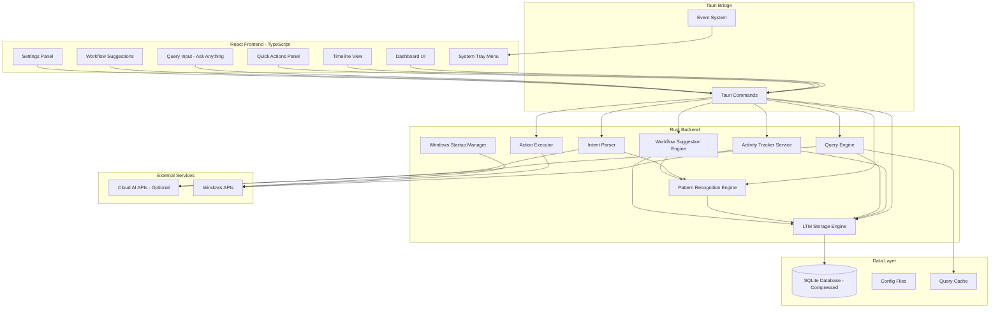
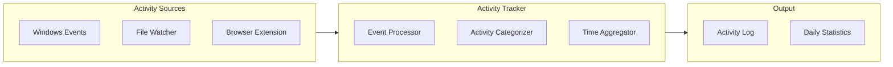
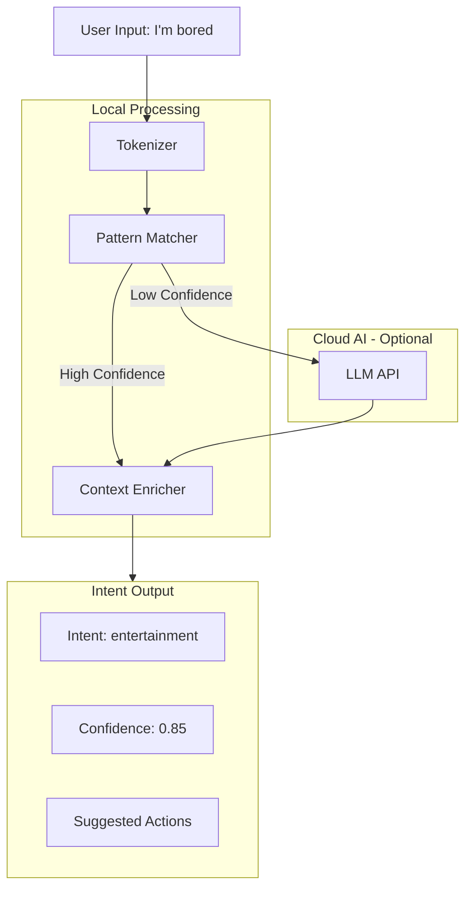
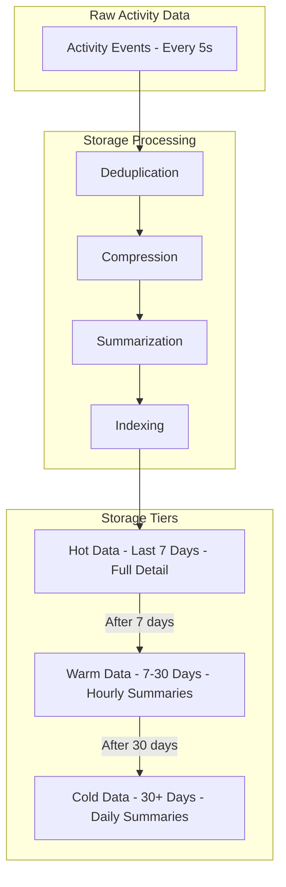
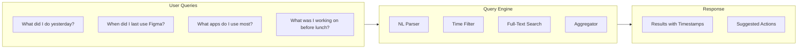
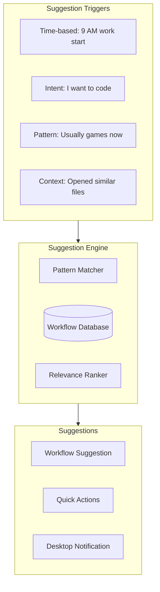
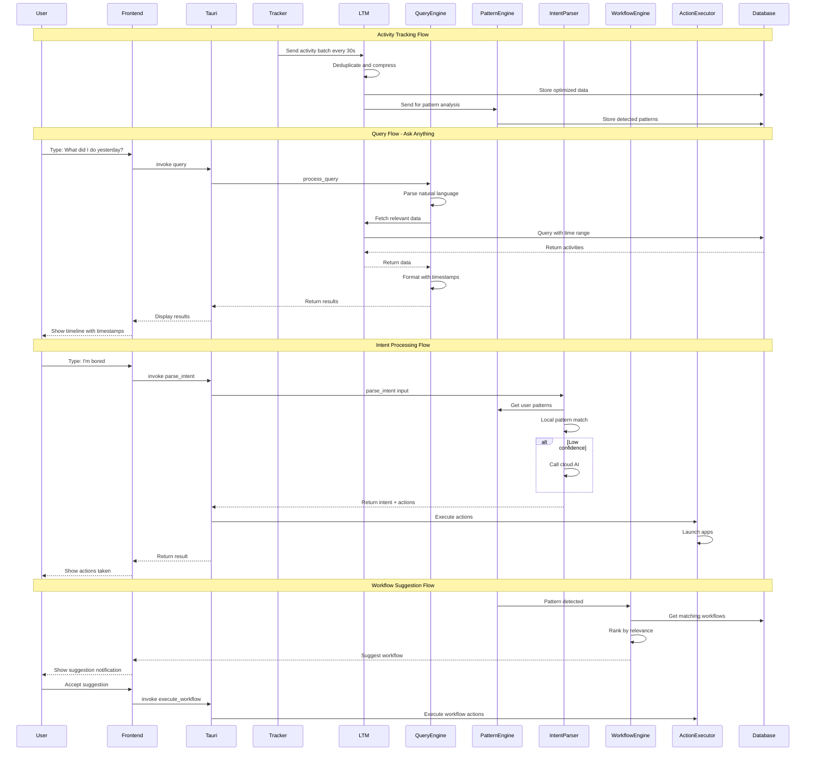

# IntentFlow Architecture

## Overview

**IntentFlow** is a Windows desktop productivity assistant that tracks your activities, learns your patterns, and responds to natural language intents to help you be more productive. Inspired by Pieces OS LTM (Long-Term Memory), it stores data efficiently and allows querying your digital history.

---

## Core Features

| Feature | Description |
|---------|-------------|
| Activity Tracking | Automatically tracks apps, files, websites, and time spent |
| Manual Entries | Tasks, notes, goals that you log yourself |
| Pattern Recognition | Learns your lifestyle and work patterns |
| Intent-Based Actions | Responds to natural language like "I'm bored" or "webdev time" |
| Quick Launch | Opens relevant apps based on context and intent |
| LTM Storage | Efficient long-term memory with compression and summarization |
| Query Engine | Ask anything about your history with timestamped responses |
| Workflow Suggestions | AI-suggested workflows based on your patterns |

---

## System Architecture



---

## Component Breakdown

### 1. Activity Tracker Service

**Purpose**: Runs in background to collect activity data

**Responsibilities**:
- Track active window and application
- Monitor file open/save operations
- Track browser tabs and URLs
- Record time spent on each activity
- Categorize activities automatically

**Tech**: Rust with Windows APIs



### 2. Pattern Recognition Engine

**Purpose**: Learn and identify patterns in user behavior

**Pattern Types**:
- **Time-based**: "Usually codes from 9 PM to 12 AM"
- **Sequence-based**: "Opens VS Code → Terminal → Browser when doing webdev"
- **Context-based**: "Uses Spotify when browsing Reddit"
- **Mood-based**: "Opens games when idle for 30+ minutes"

**Implementation**:
- Local ML model for pattern detection
- Statistical analysis of activity sequences
- Time-series analysis for daily patterns

### 3. Intent Parser

**Purpose**: Understand natural language commands

**Architecture**:



**Intent Categories**:
| Intent | Example Triggers | Actions |
|--------|------------------|---------|
| `work_start` | "webdev time", "let's code" | Open IDE, terminal, relevant projects |
| `entertainment` | "I'm bored", "break time" | Open games, YouTube, social media |
| `focus` | "focus mode", "deep work" | Block distractions, start timer |
| `learning` | "study time", "learn something" | Open courses, documentation |
| `wind_down` | "done for the day", "relax" | Close work apps, open entertainment |

### 4. Action Executor

**Purpose**: Execute actions based on intents and patterns

**Action Types**:
- Launch applications
- Open files/URLs
- Close applications
- Send notifications
- Trigger workflows

### 5. LTM Storage System (Long-Term Memory)

**Purpose**: Store activity data efficiently with minimal disk usage

**Storage Strategy**:



**Disk Optimization Techniques**:

| Technique | Description | Savings |
|-----------|-------------|---------|
| Deduplication | Merge consecutive same-app events | ~60% reduction |
| Delta Encoding | Store only changes in window titles | ~40% reduction |
| ZSTD Compression | Compress database pages | ~70% reduction |
| Hierarchical Summarization | Aggregate old data into summaries | ~90% for old data |
| Enum Categories | Store categories as integers, not strings | ~50% reduction |

**Storage Estimates**:
- Raw data: ~50MB/day
- After optimization: ~5MB/day
- Monthly storage: ~150MB
- Yearly storage: ~1.8GB (with summarization)

### 6. Query Engine

**Purpose**: Answer natural language questions about your history

**Query Types**:



**Example Queries & Responses**:

| Query | Response |
|-------|----------|
| "What did I do yesterday?" | Timeline of activities with timestamps |
| "When did I last open project X?" | "You opened project X 2 hours ago at 3:45 PM" |
| "What websites did I visit this morning?" | List of URLs with time spent |
| "How much time did I spend coding today?" | "4 hours 23 minutes across VS Code and Terminal" |
| "What was I doing before the meeting?" | Activities 30 mins before calendar event |

### 7. Workflow Suggestion System

**Purpose**: Suggest workflows based on patterns and context

**Workflow Architecture**:



**Workflow Suggestion Examples**:

| Trigger | Suggestion |
|---------|------------|
| 9 AM on weekday | "Start your morning routine?" → Open email, calendar, Slack |
| "I want to do webdev" | "Launch webdev workflow?" → VS Code, Chrome, Terminal |
| 30 min idle + evening | "Time for a break?" → Suggest entertainment apps |
| Opened React file | "Related files you worked on" → List of related components |

### 8. Storage Manager

**Purpose**: Manage data persistence

**Database Schema**:


---

## Project Structure

```
intentflow/
├── src-tauri/                    # Rust backend
│   ├── src/
│   │   ├── main.rs              # Entry point
│   │   ├── commands/            # Tauri commands
│   │   │   ├── mod.rs
│   │   │   ├── activity.rs      # Activity tracking commands
│   │   │   ├── query.rs         # Query engine commands
│   │   │   ├── intent.rs        # Intent processing commands
│   │   │   ├── workflow.rs      # Workflow commands
│   │   │   └── settings.rs      # Settings commands
│   │   ├── services/
│   │   │   ├── mod.rs
│   │   │   ├── activity_tracker.rs
│   │   │   ├── ltm_storage.rs   # Long-term memory storage
│   │   │   ├── query_engine.rs  # Natural language query
│   │   │   ├── pattern_engine.rs
│   │   │   ├── intent_parser.rs
│   │   │   ├── workflow_engine.rs
│   │   │   └── action_executor.rs
│   │   ├── models/
│   │   │   ├── mod.rs
│   │   │   ├── activity.rs
│   │   │   ├── entry.rs
│   │   │   ├── pattern.rs
│   │   │   ├── workflow.rs
│   │   │   └── query.rs
│   │   ├── database/
│   │   │   ├── mod.rs
│   │   │   ├── schema.rs
│   │   │   ├── queries.rs
│   │   │   └── migrations.rs
│   │   ├── storage/
│   │   │   ├── mod.rs
│   │   │   ├── compressor.rs    # ZSTD compression
│   │   │   ├── summarizer.rs    # Activity summarization
│   │   │   └── deduplicator.rs  # Deduplication logic
│   │   └── utils/
│   │       ├── mod.rs
│   │       ├── windows.rs       # Windows API utilities
│   │       └── hashing.rs       # Efficient hashing
│   ├── Cargo.toml
│   └── tauri.conf.json
│
├── src/                          # React frontend
│   ├── components/
│   │   ├── Dashboard/
│   │   │   ├── Dashboard.tsx
│   │   │   ├── ActivityCard.tsx
│   │   │   ├── QuickStats.tsx
│   │   │   └── StorageIndicator.tsx
│   │   ├── Timeline/
│   │   │   ├── Timeline.tsx
│   │   │   └── TimelineItem.tsx
│   │   ├── Query/
│   │   │   ├── QueryInput.tsx   # Ask anything input
│   │   │   ├── QueryResults.tsx # Results with timestamps
│   │   │   └── QueryHistory.tsx
│   │   ├── QuickActions/
│   │   │   ├── QuickActions.tsx
│   │   │   └── IntentInput.tsx
│   │   ├── Workflows/
│   │   │   ├── WorkflowList.tsx
│   │   │   ├── WorkflowSuggestion.tsx
│   │   │   └── WorkflowEditor.tsx
│   │   ├── Settings/
│   │   │   ├── Settings.tsx
│   │   │   ├── GeneralSettings.tsx
│   │   │   ├── StorageSettings.tsx
│   │   │   └── AISettings.tsx
│   │   └── common/
│   │       ├── Button.tsx
│   │       ├── Card.tsx
│   │       ├── Modal.tsx
│   │       └── Timestamp.tsx
│   ├── hooks/
│   │   ├── useActivities.ts
│   │   ├── usePatterns.ts
│   │   ├── useIntent.ts
│   │   ├── useQuery.ts
│   │   └── useWorkflows.ts
│   ├── services/
│   │   └── tauri.ts             # Tauri API wrapper
│   ├── types/
│   │   └── index.ts
│   ├── App.tsx
│   ├── main.tsx
│   └── index.css
│
├── package.json
├── tsconfig.json
├── vite.config.ts
└── tailwind.config.js
```

---

## Technology Stack

| Layer | Technology | Purpose |
|-------|------------|---------|
| Frontend | React + TypeScript | UI components |
| Styling | Tailwind CSS | Responsive design |
| Build Tool | Vite | Fast development |
| Backend | Rust + Tauri | Native performance |
| Database | SQLite | Local data storage |
| ML/Pattern | Rust ML crates | Local pattern recognition |
| Cloud AI | OpenAI API | Optional enhanced intent parsing |
| Windows APIs | winapi crate | System integration |

---

## Key Dependencies

### Rust (Cargo.toml)
```toml
[dependencies]
tauri = { version = "2", features = ["system-tray", "autostart"] }
tauri-plugin-autostart = "2"
serde = { version = "1.0", features = ["derive"] }
serde_json = "1.0"
rusqlite = { version = "0.31", features = ["bundled"] }
chrono = { version = "0.4", features = ["serde"] }
uuid = { version = "1.8", features = ["v4", "serde"] }
winapi = "0.3"
active-win-pos-rs = "0.8"
tokio = { version = "1", features = ["full"] }
reqwest = { version = "0.12", features = ["json"] }
zstd = "0.13"                    # ZSTD compression
bincode = "1.3"                  # Binary serialization
twox-hash = "1.6"                # Fast hashing
regex = "1.10"                   # Pattern matching
chrono-tz = "0.8"                # Timezone support
```

### Frontend (package.json)
```json
{
  "dependencies": {
    "react": "^18.2.0",
    "react-dom": "^18.2.0",
    "@tauri-apps/api": "^2.0.0",
    "lucide-react": "^0.344.0",
    "date-fns": "^3.3.1"
  },
  "devDependencies": {
    "typescript": "^5.4.0",
    "vite": "^5.1.0",
    "tailwindcss": "^3.4.0",
    "@tauri-apps/cli": "^2.0.0"
  }
}
```

---

## Data Flow



---

## Windows Startup Integration

Tauri provides built-in autostart support:

```rust
use tauri_plugin_autostart::MacosLauncher;

fn main() {
    tauri::Builder::default()
        .plugin(tauri_plugin_autostart::init(
            MacosLauncher::LaunchAgent,
            Some(vec!["--hidden"]),
        ))
        .run(tauri::generate_context!())
        .expect("error while running tauri application");
}
```

---

## Security & Privacy

| Concern | Solution |
|---------|----------|
| Local data | All data stored locally in SQLite |
| Cloud AI | Optional, user can disable |
| Sensitive URLs | Option to exclude private browsing |
| Data export | User can export/delete all data |
| Encryption | Optional password-protected database |

---

## Development Phases

### Phase 1: Foundation
- Set up Tauri + React project
- Implement basic activity tracking
- Create database schema with compression
- Build minimal UI

### Phase 2: Core Features
- Complete activity tracker
- Implement LTM storage with compression
- Build timeline view
- Implement manual entries
- Add system tray

### Phase 3: Intelligence
- Pattern recognition engine
- Intent parser with local matching
- Query engine for natural language questions
- Action executor

### Phase 4: Enhancement
- Cloud AI integration
- Workflow suggestion system
- Advanced patterns
- Workflow automation
- Settings and customization

---

## Implementation Workflow

```mermaid
flowchart LR
    subgraph Phase1[Phase 1: Foundation]
        A1[Setup Tauri + React]
        A2[Database Schema]
        A3[Basic Activity Tracker]
        A4[Minimal UI]
    end

    subgraph Phase2[Phase 2: Core Features]
        B1[LTM Storage]
        B2[Timeline View]
        B3[Manual Entries]
        B4[System Tray]
    end

    subgraph Phase3[Phase 3: Intelligence]
        C1[Pattern Engine]
        C2[Intent Parser]
        C3[Query Engine]
        C4[Action Executor]
    end

    subgraph Phase4[Phase 4: Enhancement]
        D1[Cloud AI]
        D2[Workflow Suggestions]
        D3[Advanced Features]
        D4[Polish and Test]
    end

    Phase1 --> Phase2 --> Phase3 --> Phase4
```



---

## Next Steps

1. Initialize Tauri + React project
2. Set up database schema with compression
3. Implement activity tracker service
4. Build basic UI components
5. Add LTM storage system
6. Implement query engine
7. Add intent parsing
8. Build workflow suggestion system

Ready to proceed with implementation?
