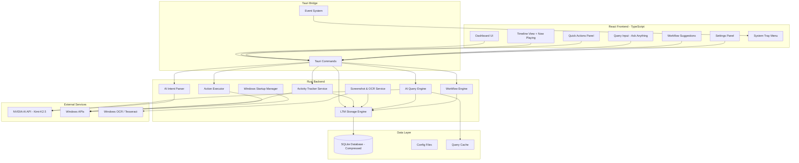
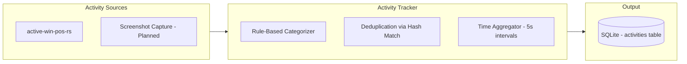
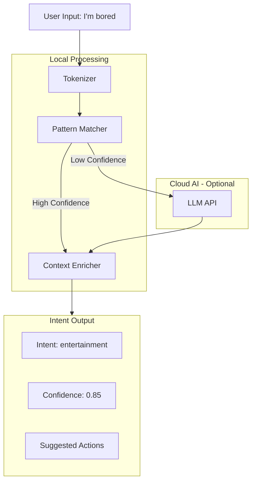
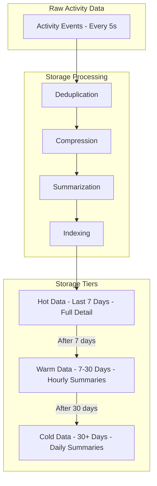
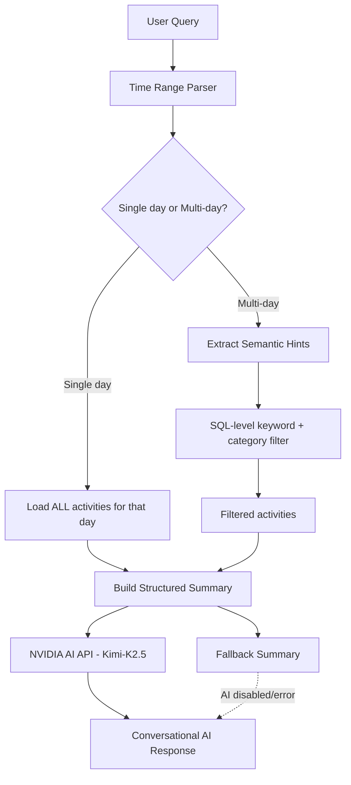
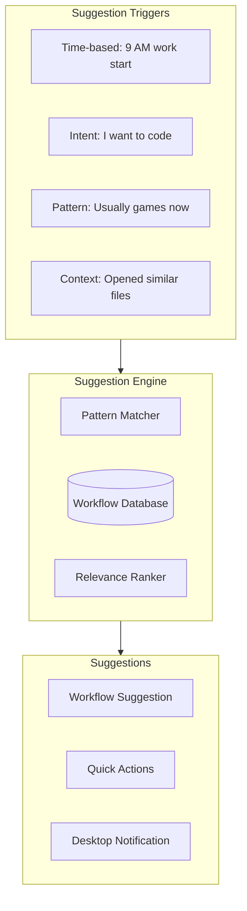
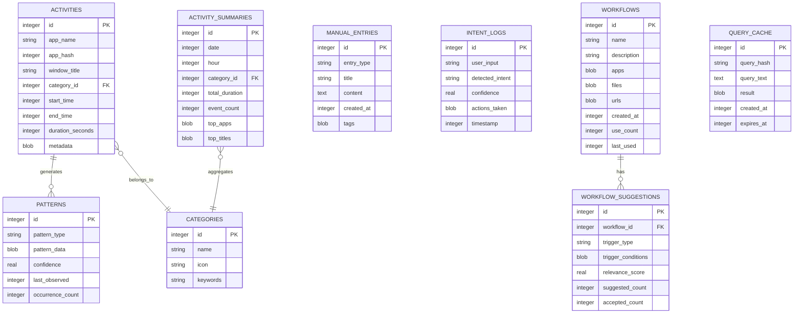
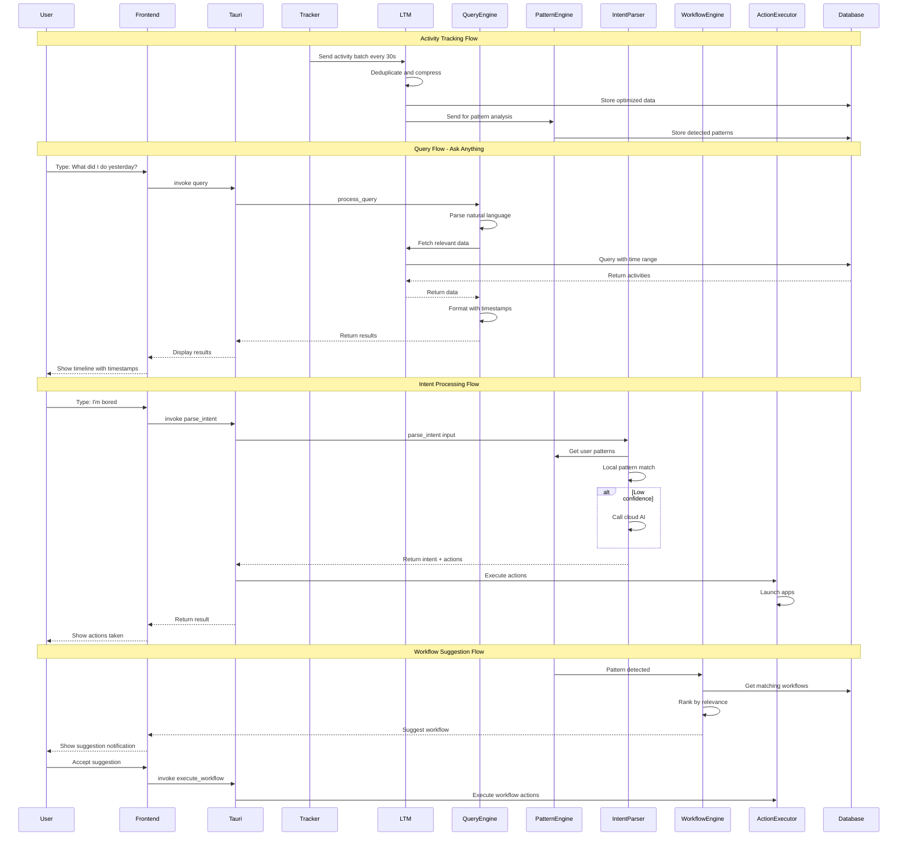

# IntentFlow Architecture

## Overview

**IntentFlow** is a Windows desktop productivity assistant that tracks your activities, learns your patterns, and responds to natural language intents to help you be more productive. Inspired by Pieces OS LTM (Long-Term Memory), it stores data efficiently and allows querying your digital history.

---

## Core Features

| Feature | Status | Description |
|---------|--------|-------------|
| Activity Tracking | ✅ Live | Tracks active window, app name, title every 5s with auto-categorization |
| AI Query Engine | ✅ Live | Natural language queries analyzed by AI (NVIDIA API / Kimi-K2.5) |
| Intent Parsing | ✅ Live | AI-powered intent detection for quick actions |
| Screenshot & OCR | ✅ Live | Periodic screen capture with text extraction for deeper context |
| Background Media | ✅ Live | Tracks music/video via Windows SMTC API (Spotify, YouTube, etc.) |
| Manual Entries | ✅ Live | Tasks, notes, goals with tags |
| Quick Launch | ✅ Live | Opens relevant apps based on context and intent |
| LTM Storage | ✅ Live | SQLite with ZSTD compression, deduplication, hash indexing |
| Workflow Suggestions | ✅ Live | AI-suggested workflows based on your patterns |
| Typo-Tolerant Parsing | ✅ Live | Handles misspellings in time queries ("yesteray" → yesterday) |

---

## System Architecture



---

## Component Breakdown

### 1. Activity Tracker Service

**Purpose**: Runs in background every 5 seconds to collect activity data

**Implementation**: `src-tauri/src/services/activity_tracker.rs`

**How it works**:
1. Polls active window via `active-win-pos-rs` crate every 5 seconds
2. Extracts `app_name` and `window_title` from the foreground window
3. Auto-categorizes using rule-based `categorize_window()` function
4. Merges consecutive events with same app/title (deduplication)
5. **Captures background media** via Windows SMTC API (Artist, Title, Status)
6. Stores to SQLite with XXH64 hashes for fast lookups
7. **Error resilience**: spawn_blocking failures logged, never silently swallowed

**Activity Categories** (priority order):
| ID | Category | Detection Logic |
|----|----------|----------------|
| 1 | Development | App name contains `code`, `cursor`, `idea`, etc. or title has code file extensions |
| 4 | Entertainment | Title contains `spotify`, `youtube`, `netflix`, or `•` (Spotify format) — checked **before** Browser |
| 2 | Browser | App name contains `chrome`, `brave`, `firefox`, `edge`, etc. |
| 3 | Communication | `slack`, `discord`, `teams`, `whatsapp`, `zoom`, etc. |
| 5 | Productivity | `notion`, `obsidian`, `word`, `excel`, `figma`, etc. |
| 6 | System | `explorer`, `settings`, `task manager` |
| 7 | Other | Default fallback |

> **Key design decision**: Entertainment title checks (Spotify "Song • Artist" format, YouTube) run _before_ the generic browser check.
> **New**: Background media (SMTC) is tracked independently, allowing the AI to know you're listening to music even while coding.



### 2. Screenshot & OCR Service (Live)

**Purpose**: Capture screen content periodically and extract text for richer activity context

**Design** (5-6 captures/min, non-blocking):
- Runs on a **separate async task** (not on the UI thread) every ~10-12 seconds
- Captures the active monitor using `xcap` or `win-screenshot` crate
- Extracts text via Windows built-in OCR API or `tesseract-rs`
- Stores extracted text in the `metadata` BLOB of the activity record
- Only processes the **active window region**, not the full screen, to reduce overhead
- Implements **content diffing** — skips OCR if the screenshot is visually identical to the last one

**Performance safeguards**:
- Async/non-blocking execution via `tokio::spawn`
- Frame skipping if previous OCR is still running
- Image downscaling before OCR (720p max)
- Rate-limited to prevent CPU overload

### 3. Intent Parser

**Purpose**: Understand natural language commands

**Architecture**:



**Intent Categories**:
| Intent | Example Triggers | Actions |
|--------|------------------|---------|
| `work_start` | "webdev time", "let's code" | Open IDE, terminal, relevant projects |
| `entertainment` | "I'm bored", "break time" | Open games, YouTube, social media |
| `focus` | "focus mode", "deep work" | Block distractions, start timer |
| `learning` | "study time", "learn something" | Open courses, documentation |
| `wind_down` | "done for the day", "relax" | Close work apps, open entertainment |

### 4. Action Executor

**Purpose**: Execute actions based on intents and patterns

**Action Types**:
- Launch applications
- Open files/URLs
- Close applications
- Send notifications
- Trigger workflows

### 5. LTM Storage System (Long-Term Memory)

**Purpose**: Store activity data efficiently with minimal disk usage

**Storage Strategy**:



**Disk Optimization Techniques**:

| Technique | Description | Savings |
|-----------|-------------|---------|
| Deduplication | Merge consecutive same-app events | ~60% reduction |
| Delta Encoding | Store only changes in window titles | ~40% reduction |
| ZSTD Compression | Compress database pages | ~70% reduction |
| Hierarchical Summarization | Aggregate old data into summaries | ~90% for old data |
| Enum Categories | Store categories as integers, not strings | ~50% reduction |

**Storage Estimates**:
- Raw data: ~50MB/day
- After optimization: ~5MB/day
- Monthly storage: ~150MB
- Yearly storage: ~1.8GB (with summarization)

### 6. AI Query Engine

**Purpose**: Answer natural language questions about your activity history using AI analysis

**Implementation**: `src-tauri/src/commands/query.rs`

**Architecture — Two-Tier Strategy**:



**Key components**:

| Component | Function |
|-----------|----------|
| `parse_query_time_range()` | Typo-tolerant NL time parsing (yesterday, last week, N hours ago, day names, morning/afternoon/evening) |
| `extract_search_hints()` | Maps query keywords → DB-level filters ("songs" → Spotify/YouTube categories) |
| `build_structured_data()` | Aggregates per-app time, per-category time, and activity timeline for AI context |
| `ai_summarize_query()` | Sends structured data + query to NVIDIA API with rich system prompt |
| `build_fallback_summary()` | Static summary when AI is unavailable |
| `extract_app_filter()` | Identifies app names in query for timeline filtering |
| `expand_app_aliases()` | Maps "vs code" → ["visual studio code", "code"], etc. |

**AI Integration**:
- **Provider**: NVIDIA NIM API (`integrate.api.nvidia.com`)
- **Model**: `moonshotai/kimi-k2.5` (configurable)
- **System Prompt**: Rich context about IntentFlow categories, data format, response style
- **Max Tokens**: 512
- **Approach**: Agentic — AI receives ALL data and interprets context, handles typos, infers meaning

**Semantic Search Hints** (for multi-day queries):
| Query keyword | Maps to |
|--------------|----------|
| "songs", "music", "listened" | keywords: `spotify`, `soundcloud`, `•` + category 4 |
| "coding", "programming" | keywords: `code`, `terminal`, `git` + category 1 |
| "chatting", "messages" | keywords: `whatsapp`, `discord`, `slack` + category 3 |
| "browsing", "websites" | keywords: `chrome`, `brave`, `firefox` + category 2 |

**Example Queries & AI Responses**:

| Query | AI Response Style |
|-------|----------|
| "What did I do yesterday?" | Conversational summary with time blocks and key activities |
| "What websites did I visit this morning?" | Lists specific sites, times, and durations naturally |
| "What songs did I listen to this month?" | Multi-day search → DB filter for Spotify/music → AI summary |
| "How productive was I today?" | AI analyzes dev vs entertainment ratio, gives insights |

### 7. Workflow Suggestion System

**Purpose**: Suggest workflows based on patterns and context

**Workflow Architecture**:



**Workflow Suggestion Examples**:

| Trigger | Suggestion |
|---------|------------|
| 9 AM on weekday | "Start your morning routine?" → Open email, calendar, Slack |
| "I want to do webdev" | "Launch webdev workflow?" → VS Code, Chrome, Terminal |
| 30 min idle + evening | "Time for a break?" → Suggest entertainment apps |
| Opened React file | "Related files you worked on" → List of related components |

### 8. Storage Manager

**Purpose**: Manage data persistence

**Database Schema**:



---

## Project Structure

```
intentflow/
├── src-tauri/                    # Rust backend
│   ├── src/
│   │   ├── main.rs              # Entry point
│   │   ├── commands/            # Tauri commands
│   │   │   ├── mod.rs
│   │   │   ├── activity.rs      # Activity tracking commands
│   │   │   ├── query.rs         # Query engine commands
│   │   │   ├── intent.rs        # Intent processing commands
│   │   │   ├── workflow.rs      # Workflow commands
│   │   │   └── settings.rs      # Settings commands
│   │   ├── services/
│   │   │   ├── mod.rs
│   │   │   ├── activity_tracker.rs
│   │   │   ├── ltm_storage.rs   # Long-term memory storage
│   │   │   ├── query_engine.rs  # Natural language query
│   │   │   ├── pattern_engine.rs
│   │   │   ├── intent_parser.rs
│   │   │   ├── workflow_engine.rs
│   │   │   └── action_executor.rs
│   │   ├── models/
│   │   │   ├── mod.rs
│   │   │   ├── activity.rs
│   │   │   ├── entry.rs
│   │   │   ├── pattern.rs
│   │   │   ├── workflow.rs
│   │   │   └── query.rs
│   │   ├── database/
│   │   │   ├── mod.rs
│   │   │   ├── schema.rs
│   │   │   ├── queries.rs
│   │   │   └── migrations.rs
│   │   ├── storage/
│   │   │   ├── mod.rs
│   │   │   ├── compressor.rs    # ZSTD compression
│   │   │   ├── summarizer.rs    # Activity summarization
│   │   │   └── deduplicator.rs  # Deduplication logic
│   │   └── utils/
│   │       ├── mod.rs
│   │       ├── windows.rs       # Windows API utilities
│   │       └── hashing.rs       # Efficient hashing
│   ├── Cargo.toml
│   └── tauri.conf.json
│
├── src/                          # React frontend
│   ├── components/
│   │   ├── Dashboard/
│   │   │   ├── Dashboard.tsx
│   │   │   ├── ActivityCard.tsx
│   │   │   ├── QuickStats.tsx
│   │   │   └── StorageIndicator.tsx
│   │   ├── Timeline/
│   │   │   ├── Timeline.tsx
│   │   │   └── TimelineItem.tsx
│   │   ├── Query/
│   │   │   ├── QueryInput.tsx   # Ask anything input
│   │   │   ├── QueryResults.tsx # Results with timestamps
│   │   │   └── QueryHistory.tsx
│   │   ├── QuickActions/
│   │   │   ├── QuickActions.tsx
│   │   │   └── IntentInput.tsx
│   │   ├── Workflows/
│   │   │   ├── WorkflowList.tsx
│   │   │   ├── WorkflowSuggestion.tsx
│   │   │   └── WorkflowEditor.tsx
│   │   ├── Settings/
│   │   │   ├── Settings.tsx
│   │   │   ├── GeneralSettings.tsx
│   │   │   ├── StorageSettings.tsx
│   │   │   └── AISettings.tsx
│   │   └── common/
│   │       ├── Button.tsx
│   │       ├── Card.tsx
│   │       ├── Modal.tsx
│   │       └── Timestamp.tsx
│   ├── hooks/
│   │   ├── useActivities.ts
│   │   ├── usePatterns.ts
│   │   ├── useIntent.ts
│   │   ├── useQuery.ts
│   │   └── useWorkflows.ts
│   ├── services/
│   │   └── tauri.ts             # Tauri API wrapper
│   ├── types/
│   │   └── index.ts
│   ├── App.tsx
│   ├── main.tsx
│   └── index.css
│
├── package.json
├── tsconfig.json
├── vite.config.ts
└── tailwind.config.js
```

---

## Technology Stack

| Layer | Technology | Purpose |
|-------|------------|---------|
| Frontend | React 18 + TypeScript | UI components |
| Styling | Tailwind CSS 3 | Responsive design |
| Build Tool | Vite 5 | Fast development |
| Backend | Rust + Tauri 2 | Native performance |
| Database | SQLite (rusqlite 0.31) | Local data storage |
| AI Provider | NVIDIA NIM API | Query analysis & intent parsing |
| AI Model | `moonshotai/kimi-k2.5` | Conversational activity analysis |
| Window Tracking | `active-win-pos-rs` | Active window detection |
| Compression | `zstd` 0.13 | ZSTD metadata compression |
| Hashing | `twox-hash` 1.6 | XXH64 fast deduplication hashes |
| HTTP Client | `reqwest` 0.12 | AI API calls |
| Windows APIs | `winapi` 0.3 | System integration |
| Screenshot (planned) | `xcap` / `win-screenshot` | Periodic screen capture |
| OCR (planned) | `tesseract-rs` / Windows OCR | Text extraction from screenshots |

---

## Key Dependencies

### Rust (Cargo.toml)
```toml
[dependencies]
tauri = { version = "2", features = ["tray-icon"] }
tauri-plugin-autostart = "2"
serde = { version = "1.0", features = ["derive"] }
serde_json = "1.0"
rusqlite = { version = "0.31", features = ["bundled"] }
chrono = { version = "0.4", features = ["serde"] }
uuid = { version = "1.8", features = ["v4", "serde"] }
winapi = { version = "0.3", features = ["winuser", "processthreadsapi", "handleapi", "psapi"] }
tokio = { version = "1", features = ["full"] }
reqwest = { version = "0.12", features = ["json"] }
zstd = "0.13"                    # ZSTD compression
bincode = "1.3"                  # Binary serialization
twox-hash = "1.6"                # XXH64 fast hashing
regex = "1.10"                   # NL query pattern matching
chrono-tz = "0.8"                # Timezone support
anyhow = "1.0"                   # Error handling
thiserror = "1.0"                # Typed errors
log = "0.4"                      # Logging facade
env_logger = "0.11"              # Logger implementation
active-win-pos-rs = "0.8"        # Active window detection
open = "5"                       # Open URLs/files
```

### Frontend (package.json)
```json
{
  "dependencies": {
    "react": "^18.2.0",
    "react-dom": "^18.2.0",
    "@tauri-apps/api": "^2.0.0",
    "lucide-react": "^0.344.0",
    "date-fns": "^3.3.1"
  },
  "devDependencies": {
    "typescript": "^5.4.0",
    "vite": "^5.1.0",
    "tailwindcss": "^3.4.0",
    "@tauri-apps/cli": "^2.0.0"
  }
}
```

---

## Data Flow



---

## Windows Startup Integration

Tauri provides built-in autostart support:

```rust
use tauri_plugin_autostart::MacosLauncher;

fn main() {
    tauri::Builder::default()
        .plugin(tauri_plugin_autostart::init(
            MacosLauncher::LaunchAgent,
            Some(vec!["--hidden"]),
        ))
        .run(tauri::generate_context!())
        .expect("error while running tauri application");
}
```

---

## Security & Privacy

| Concern | Solution |
|---------|----------|
| Local data | All data stored locally in SQLite |
| Cloud AI | Optional, user can disable |
| Sensitive URLs | Option to exclude private browsing |
| Data export | User can export/delete all data |
| Encryption | Optional password-protected database |

---

## Development Phases

### Phase 1: Foundation ✅
- Tauri 2 + React 18 + Vite project setup
- SQLite database schema with WAL mode
- Activity tracker service (5s polling loop)
- Rule-based categorization engine
- Basic dashboard UI

### Phase 2: Core Features ✅
- Full activity tracker with deduplication
- LTM storage with ZSTD compression
- Timeline view with activity cards
- Manual entries (tasks, notes, goals)
- System tray with autostart
- Settings panel (General, Tracking, Storage, AI, Privacy)

### Phase 3: Intelligence ✅
- AI-powered query engine via NVIDIA NIM API
- Two-tier query strategy (single-day agentic vs multi-day filtered)
- AI intent parser for quick actions
- Semantic search hints (`extract_search_hints`)
- Typo-tolerant time parsing
- App alias expansion
- Smart category detection (Spotify/YouTube → Entertainment before Browser)

### Phase 4: Enhancement 🔜
- Screenshot capture service (every 10-12s)
- OCR text extraction from screenshots
- Enhanced metadata storage with screen text
- Cross-day activity insights
- Advanced pattern recognition

---

## Next Steps

1. **Screenshot & OCR** — Add periodic screen capture with text extraction
2. **Dead code cleanup** — Remove unused functions flagged by compiler
3. **API key security** — Move hardcoded key to environment variable
4. **Advanced patterns** — Time-series analysis for daily routines
5. **Data export** — Allow users to export activity history
