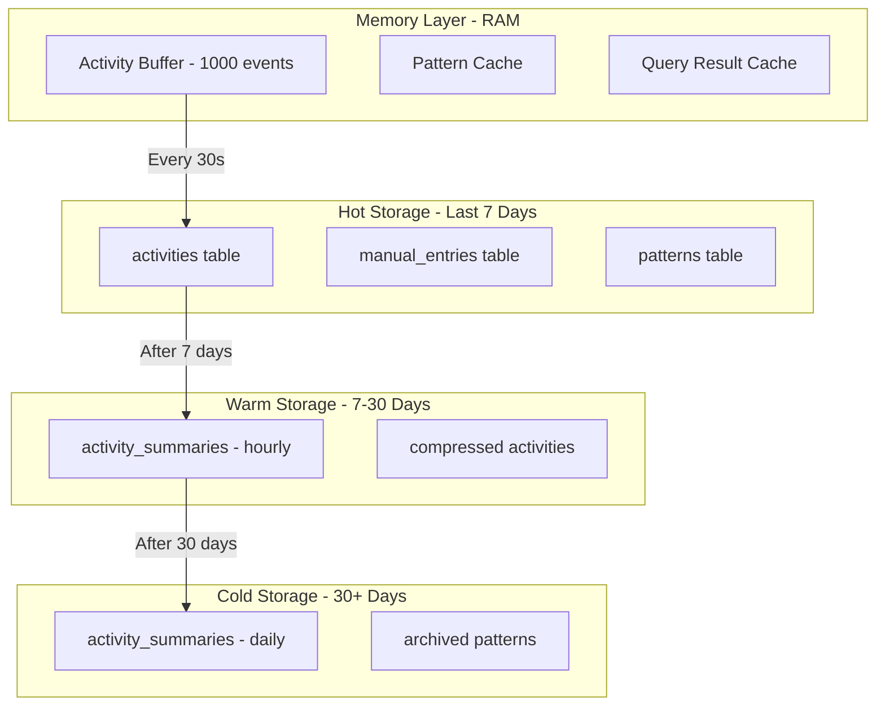

# IntentFlow - Complete Technical Specification

## Table of Contents
1. [Application Overview](#application-overview)
2. [Data Storage Architecture](#data-storage-architecture)
3. [File Formats and Structure](#file-formats-and-structure)
4. [Database Schema](#database-schema)
5. [LTM Storage Implementation](#ltm-storage-implementation)
6. [Component Specifications](#component-specifications)
7. [API Specifications](#api-specifications)
8. [Configuration Files](#configuration-files)
9. [Build and Deployment](#build-and-deployment)

---

## Application Overview

### Application Identity
| Property | Value |
|----------|-------|
| Name | IntentFlow |
| Type | Windows Desktop Application |
| Version | 1.0.0 |
| Platform | Windows 10/11 |
| Architecture | x64 |
| License | MIT |

### Application Directory Structure
```
%APPDATA%/IntentFlow/
├── data/
│   ├── intentflow.db              # Main SQLite database
│   ├── intentflow.db-wal          # Write-Ahead Log
│   ├── intentflow.db-shm          # Shared Memory
│   ├── cache/
│   │   ├── query_cache.db         # Query result cache
│   │   └── thumbnails/            # App icons cache
│   └── exports/                   # User data exports
├── config/
│   ├── settings.json              # User settings
│   ├── categories.json            # Activity categories
│   ├── workflows.json             # Custom workflows
│   └── ai_config.json             # AI configuration
├── logs/
│   ├── intentflow.log             # Application log
│   └── error.log                  # Error log
└── temp/
    └── uploads/                   # Temporary file uploads
```

---

## Data Storage Architecture

### Storage Hierarchy



### Storage Optimization Techniques

#### 1. Deduplication
**Purpose**: Merge consecutive events with same app and similar window title

**Algorithm**:
```rust
// Pseudocode for deduplication
fn deduplicate_events(events: Vec<ActivityEvent>) -> Vec<ActivityEvent> {
    let mut deduped = Vec::new();
    let mut current: Option<ActivityEvent> = None;
    
    for event in events {
        match &current {
            Some(curr) if is_similar(curr, &event) => {
                // Merge: update end time, increment duration
                current = Some(merge_events(curr, &event));
            }
            _ => {
                if let Some(curr) = current.take() {
                    deduped.push(curr);
                }
                current = Some(event);
            }
        }
    }
    
    if let Some(curr) = current {
        deduped.push(curr);
    }
    
    deduped
}

fn is_similar(a: &ActivityEvent, b: &ActivityEvent) -> bool {
    a.app_hash == b.app_hash && 
    a.category_id == b.category_id &&
    (a.window_title_hash == b.window_title_hash || 
     time_diff(a.end_time, b.start_time) < 60)
}
```

**Expected Savings**: ~60% reduction in event count

#### 2. Delta Encoding
**Purpose**: Store only changes in window titles

**Format**:
```json
{
  "base_title": "IntentFlow - Visual Studio Code",
  "deltas": [
    {"offset": 0, "change": "Dashboard", "length": 9},
    {"offset": 12, "change": "Settings", "length": 8}
  ]
}
```

**Expected Savings**: ~40% reduction in title storage

#### 3. ZSTD Compression
**Purpose**: Compress database pages and large text fields

**Configuration**:
```rust
// Compression level: 3 (balanced speed/ratio)
const COMPRESSION_LEVEL: i32 = 3;

// Compress before storing in BLOB fields
fn compress_data(data: &[u8]) -> Vec<u8> {
    zstd::encode_all(data, COMPRESSION_LEVEL).unwrap()
}

// Decompress on read
fn decompress_data(compressed: &[u8]) -> Vec<u8> {
    zstd::decode_all(compressed).unwrap()
}
```

**Expected Savings**: ~70% reduction in storage size

#### 4. Hierarchical Summarization
**Purpose**: Aggregate old data into summaries

**Summary Levels**:

| Level | Time Range | Granularity | Data Stored |
|-------|------------|-------------|-------------|
| Hot | 0-7 days | Per event | Full detail |
| Warm | 7-30 days | Hourly | Aggregated stats |
| Cold | 30+ days | Daily | Aggregated stats |

**Summary Schema**:
```sql
CREATE TABLE activity_summaries (
    id INTEGER PRIMARY KEY AUTOINCREMENT,
    date INTEGER NOT NULL,           -- Unix timestamp (day start)
    hour INTEGER,                    -- NULL for daily summaries
    category_id INTEGER NOT NULL,
    total_duration INTEGER NOT NULL, -- Total seconds
    event_count INTEGER NOT NULL,
    top_apps BLOB,                   -- Compressed JSON of top apps
    top_titles BLOB,                 -- Compressed JSON of top titles
    FOREIGN KEY (category_id) REFERENCES categories(id)
);
```

**Expected Savings**: ~90% reduction for data older than 30 days

#### 5. Integer Encoding
**Purpose**: Use integers instead of strings for repeated values

**Examples**:
- App names → `app_hash` (XXH64 hash)
- Categories → `category_id` (integer)
- Timestamps → Unix timestamp (integer)

**Expected Savings**: ~50% reduction in string storage

---

## File Formats and Structure

### 1. SQLite Database (intentflow.db)

**File Format**: SQLite 3
**Page Size**: 4096 bytes
**Encoding**: UTF-8
**Journal Mode**: WAL (Write-Ahead Logging)

**Database Pragmas**:
```sql
PRAGMA journal_mode = WAL;
PRAGMA synchronous = NORMAL;
PRAGMA cache_size = -64000;  -- 64MB cache
PRAGMA temp_store = MEMORY;
PRAGMA page_size = 4096;
PRAGMA foreign_keys = ON;
```

**File Size Estimates**:
- Empty database: ~32KB
- 1 day of data: ~5MB
- 1 month of data: ~150MB
- 1 year of data: ~1.8GB

### 2. Configuration Files

#### settings.json
```json
{
  "version": "1.0.0",
  "general": {
    "language": "en",
    "theme": "dark",
    "startup_behavior": "minimized_to_tray",
    "minimize_to_tray": true,
    "close_to_tray": true
  },
  "tracking": {
    "enabled": true,
    "tracking_interval": 5,
    "idle_timeout": 300,
    "exclude_apps": [],
    "exclude_urls": [],
    "track_browser": true
  },
  "storage": {
    "retention_days": 365,
    "auto_cleanup": true,
    "compression_enabled": true,
    "max_cache_size_mb": 512
  },
  "ai": {
    "enabled": true,
    "provider": "nvidia",
    "api_key": "nvapi-...",
    "model": "moonshotai/kimi-k2.5",
    "base_url": "https://integrate.api.nvidia.com/v1",
    "local_only": false,
    "fallback_to_local": true,
    "max_tokens": 512
  },
  "privacy": {
    "encrypt_database": false,
    "exclude_incognito": true,
    "anonymize_data": false
  },
  "notifications": {
    "workflow_suggestions": true,
    "pattern_insights": true,
    "daily_summary": true,
    "summary_time": "09:00"
  }
}
```

#### categories.json
```json
{
  "categories": [
    {
      "id": 1,
      "name": "Development",
      "icon": "code",
      "color": "#3b82f6",
      "keywords": ["vscode", "terminal", "git", "code", "intellij", "pycharm"],
      "apps": ["Code.exe", "git-bash.exe", "idea64.exe"]
    },
    {
      "id": 2,
      "name": "Browser",
      "icon": "globe",
      "color": "#10b981",
      "keywords": ["chrome", "firefox", "edge", "safari", "browser"],
      "apps": ["chrome.exe", "firefox.exe", "msedge.exe"]
    },
    {
      "id": 3,
      "name": "Communication",
      "icon": "message-circle",
      "color": "#8b5cf6",
      "keywords": ["slack", "discord", "teams", "zoom", "meet"],
      "apps": ["slack.exe", "discord.exe", "teams.exe"]
    },
    {
      "id": 4,
      "name": "Entertainment",
      "icon": "play",
      "color": "#f59e0b",
      "keywords": ["youtube", "spotify", "netflix", "game", "steam"],
      "apps": ["spotify.exe", "steam.exe"]
    },
    {
      "id": 5,
      "name": "Productivity",
      "icon": "check-square",
      "color": "#ec4899",
      "keywords": ["notion", "obsidian", "todo", "task", "calendar"],
      "apps": ["notion.exe", "obsidian.exe"]
    },
    {
      "id": 6,
      "name": "System",
      "icon": "settings",
      "color": "#6b7280",
      "keywords": ["explorer", "settings", "task manager"],
      "apps": ["explorer.exe", "SystemSettings.exe"]
    },
    {
      "id": 7,
      "name": "Other",
      "icon": "more-horizontal",
      "color": "#9ca3af",
      "keywords": [],
      "apps": []
    }
  ]
}
```

#### workflows.json
```json
{
  "workflows": [
    {
      "id": "wf_001",
      "name": "Web Development",
      "description": "Launch web development environment",
      "icon": "code",
      "apps": [
        {"path": "C:\\Program Files\\Microsoft VS Code\\Code.exe", "args": []},
        {"path": "C:\\Program Files\\Git\\git-bash.exe", "args": []},
        {"path": "C:\\Program Files\\Google\\Chrome\\Application\\chrome.exe", "args": []}
      ],
      "urls": [
        "https://github.com",
        "https://stackoverflow.com"
      ],
      "files": [],
      "use_count": 42,
      "last_used": 1739356800,
      "created_at": 1736678400
    },
    {
      "id": "wf_002",
      "name": "Morning Routine",
      "description": "Start your day with essential apps",
      "icon": "sun",
      "apps": [
        {"path": "C:\\Program Files\\Mozilla Thunderbird\\thunderbird.exe", "args": []},
        {"path": "C:\\Users\\%USERNAME%\\AppData\\Local\\Slack\\slack.exe", "args": []}
      ],
      "urls": [],
      "files": [],
      "use_count": 15,
      "last_used": 1739356800,
      "created_at": 1736678400
    }
  ]
}
```

#### ai_config.json
```json
{
  "providers": {
    "nvidia": {
      "enabled": true,
      "api_key": "nvapi-...",
      "base_url": "https://integrate.api.nvidia.com/v1",
      "model": "moonshotai/kimi-k2.5",
      "max_tokens": 512,
      "temperature": 0.7
    }
  },
  "local_patterns": {
    "enabled": true,
    "min_confidence": 0.6,
    "max_patterns": 100
  },
  "query_cache": {
    "enabled": true,
    "ttl_seconds": 3600,
    "max_entries": 1000
  }
}
```

### 3. Log Files

#### intentflow.log
**Format**: Plain text with timestamps
**Rotation**: Daily, keep 7 days
**Example**:
```
2025-02-12 13:00:00 [INFO] Application started
2025-02-12 13:00:01 [INFO] Activity tracker initialized
2025-02-12 13:00:02 [INFO] Database connection established
2025-02-12 13:00:05 [INFO] System tray icon created
2025-02-12 13:01:00 [DEBUG] Activity logged: VS Code - IntentFlow
2025-02-12 13:02:00 [DEBUG] Activity logged: Chrome - GitHub
```

#### error.log
**Format**: JSON for structured error logging
**Example**:
```json
{
  "timestamp": "2025-02-12T13:00:00Z",
  "level": "ERROR",
  "message": "Failed to connect to database",
  "error": "DatabaseLocked",
  "stack_trace": "...",
  "context": {
    "database_path": "C:\\Users\\...\\intentflow.db"
  }
}
```

---

## Database Schema

### Complete Schema

```sql
-- Enable foreign keys
PRAGMA foreign_keys = ON;

-- Categories table
CREATE TABLE categories (
    id INTEGER PRIMARY KEY AUTOINCREMENT,
    name TEXT NOT NULL UNIQUE,
    icon TEXT NOT NULL,
    color TEXT NOT NULL,
    keywords TEXT,                    -- JSON array of keywords
    apps TEXT,                        -- JSON array of app names
    created_at INTEGER NOT NULL       -- Unix timestamp
);

-- Activities table (hot storage - last 7 days)
CREATE TABLE activities (
    id INTEGER PRIMARY KEY AUTOINCREMENT,
    app_name TEXT NOT NULL,
    app_hash INTEGER NOT NULL,        -- XXH64 hash of app_name
    window_title TEXT,
    window_title_hash INTEGER,        -- XXH64 hash of window_title
    category_id INTEGER NOT NULL,
    start_time INTEGER NOT NULL,      -- Unix timestamp
    end_time INTEGER NOT NULL,        -- Unix timestamp
    duration_seconds INTEGER NOT NULL,
    metadata BLOB,                    -- Compressed JSON: {is_idle, screen_text, media_info: {title, artist, status}}
    FOREIGN KEY (category_id) REFERENCES categories(id)
);

-- Create indexes for performance
CREATE INDEX idx_activities_start_time ON activities(start_time);
CREATE INDEX idx_activities_app_hash ON activities(app_hash);
CREATE INDEX idx_activities_category_id ON activities(category_id);
CREATE INDEX idx_activities_window_title_hash ON activities(window_title_hash);

-- Activity summaries (warm/cold storage)
CREATE TABLE activity_summaries (
    id INTEGER PRIMARY KEY AUTOINCREMENT,
    date INTEGER NOT NULL,           -- Unix timestamp (day start)
    hour INTEGER,                    -- NULL for daily summaries
    category_id INTEGER NOT NULL,
    total_duration INTEGER NOT NULL, -- Total seconds
    event_count INTEGER NOT NULL,
    top_apps BLOB,                   -- Compressed JSON: [{app, duration, count}]
    top_titles BLOB,                 -- Compressed JSON: [{title, duration, count}]
    FOREIGN KEY (category_id) REFERENCES categories(id),
    UNIQUE(date, hour, category_id)
);

CREATE INDEX idx_summaries_date ON activity_summaries(date);
CREATE INDEX idx_summaries_category_id ON activity_summaries(category_id);

-- Manual entries table
CREATE TABLE manual_entries (
    id INTEGER PRIMARY KEY AUTOINCREMENT,
    entry_type TEXT NOT NULL,        -- 'task', 'note', 'goal'
    title TEXT NOT NULL,
    content TEXT,
    tags BLOB,                       -- Compressed JSON array
    status TEXT DEFAULT 'active',    -- 'active', 'completed', 'archived'
    created_at INTEGER NOT NULL,
    updated_at INTEGER NOT NULL,
    completed_at INTEGER
);

CREATE INDEX idx_entries_type ON manual_entries(entry_type);
CREATE INDEX idx_entries_created_at ON manual_entries(created_at);
CREATE INDEX idx_entries_status ON manual_entries(status);

-- Patterns table
CREATE TABLE patterns (
    id INTEGER PRIMARY KEY AUTOINCREMENT,
    pattern_type TEXT NOT NULL,      -- 'time', 'sequence', 'context', 'mood'
    pattern_data BLOB NOT NULL,      -- Compressed JSON pattern data
    confidence REAL NOT NULL,        -- 0.0 to 1.0
    last_observed INTEGER NOT NULL,  -- Unix timestamp
    occurrence_count INTEGER NOT NULL,
    is_active INTEGER DEFAULT 1      -- 0 = archived, 1 = active
);

CREATE INDEX idx_patterns_type ON patterns(pattern_type);
CREATE INDEX idx_patterns_last_observed ON patterns(last_observed);
CREATE INDEX idx_patterns_active ON patterns(is_active);

-- Intent logs table
CREATE TABLE intent_logs (
    id INTEGER PRIMARY KEY AUTOINCREMENT,
    user_input TEXT NOT NULL,
    detected_intent TEXT NOT NULL,
    confidence REAL NOT NULL,
    actions_taken BLOB,              -- Compressed JSON array
    timestamp INTEGER NOT NULL
);

CREATE INDEX idx_intent_logs_timestamp ON intent_logs(timestamp);

-- Workflows table
CREATE TABLE workflows (
    id INTEGER PRIMARY KEY AUTOINCREMENT,
    uuid TEXT NOT NULL UNIQUE,       -- UUID for external reference
    name TEXT NOT NULL,
    description TEXT,
    icon TEXT,
    apps BLOB,                       -- Compressed JSON: [{path, args}]
    files BLOB,                      -- Compressed JSON: [paths]
    urls BLOB,                       -- Compressed JSON: [urls]
    use_count INTEGER DEFAULT 0,
    last_used INTEGER,
    created_at INTEGER NOT NULL
);

CREATE INDEX idx_workflows_uuid ON workflows(uuid);

-- Workflow suggestions table
CREATE TABLE workflow_suggestions (
    id INTEGER PRIMARY KEY AUTOINCREMENT,
    workflow_id INTEGER NOT NULL,
    trigger_type TEXT NOT NULL,      -- 'time', 'intent', 'pattern', 'context'
    trigger_conditions BLOB NOT NULL, -- Compressed JSON conditions
    relevance_score REAL NOT NULL,   -- 0.0 to 1.0
    suggested_count INTEGER DEFAULT 0,
    accepted_count INTEGER DEFAULT 0,
    last_suggested INTEGER,
    FOREIGN KEY (workflow_id) REFERENCES workflows(id)
);

CREATE INDEX idx_workflow_suggestions_workflow_id ON workflow_suggestions(workflow_id);
CREATE INDEX idx_workflow_suggestions_trigger_type ON workflow_suggestions(trigger_type);

-- Query cache table
CREATE TABLE query_cache (
    id INTEGER PRIMARY KEY AUTOINCREMENT,
    query_hash TEXT NOT NULL UNIQUE,  -- SHA256 hash of query
    query_text TEXT NOT NULL,
    result BLOB NOT NULL,             -- Compressed JSON result
    created_at INTEGER NOT NULL,
    expires_at INTEGER NOT NULL
);

CREATE INDEX idx_query_cache_expires_at ON query_cache(expires_at);

-- Settings table (for database-stored settings)
CREATE TABLE settings (
    key TEXT PRIMARY KEY,
    value BLOB NOT NULL,              -- Compressed JSON value
    updated_at INTEGER NOT NULL
);

-- App registry table (for app metadata)
CREATE TABLE app_registry (
    id INTEGER PRIMARY KEY AUTOINCREMENT,
    app_name TEXT NOT NULL UNIQUE,
    app_hash INTEGER NOT NULL UNIQUE,
    display_name TEXT,
    icon_path TEXT,
    category_id INTEGER,
    first_seen INTEGER NOT NULL,
    last_seen INTEGER NOT NULL,
    usage_count INTEGER DEFAULT 0,
    total_duration INTEGER DEFAULT 0,
    FOREIGN KEY (category_id) REFERENCES categories(id)
);

CREATE INDEX idx_app_registry_app_hash ON app_registry(app_hash);
```

### Data Types and Sizes

| Column | Type | Size | Notes |
|--------|------|------|-------|
| id | INTEGER | 4 bytes | Auto-increment |
| app_name | TEXT | Variable | Stored once in app_registry |
| app_hash | INTEGER | 8 bytes | XXH64 hash |
| window_title | TEXT | Variable | Compressed in BLOB |
| category_id | INTEGER | 4 bytes | Foreign key |
| start_time | INTEGER | 8 bytes | Unix timestamp |
| end_time | INTEGER | 8 bytes | Unix timestamp |
| duration_seconds | INTEGER | 4 bytes | |
| metadata | BLOB | Variable | JSON: `{"media_info": {...}, "screen_text": "...", "background_windows": [...]}` |
| confidence | REAL | 8 bytes | Float 0.0-1.0 |

---

## LTM Storage Implementation

### Storage Pipeline

```mermaid
flowchart LR
    subgraph Collection[Activity Collection]
        A1[Raw Events - Every 5s]
    end

    subgraph Processing[Processing Pipeline]
        B1[Deduplication]
        B2[Hash Generation]
        B3[Category Assignment]
        B4[Delta Encoding]
    end

    subgraph Compression[Compression Layer]
        C1[ZSTD Compression]
        C2[Binary Serialization]
    end

    subgraph Storage[Storage Tiers]
        D1[Hot - activities table]
        D2[Warm - hourly summaries]
        D3[Cold - daily summaries]
    end

    A1 --> B1 --> B2 --> B3 --> B4 --> C1 --> C2 --> D1
    D1 -->|After 7 days| D2
    D2 -->|After 30 days| D3
```



### Hash Generation

**App Hash (XXH64)**:
```rust
use twox_hash::XxHash64;
use std::hash::Hasher;

fn compute_app_hash(app_name: &str) -> u64 {
    let mut hasher = XxHash64::default();
    hasher.write(app_name.as_bytes());
    hasher.finish()
}

// Example:
// "Code.exe" → 0x8f7d3a2b1c9e4f6d
// "chrome.exe" → 0x3e9f2a1b4c7d8e5f
```

**Window Title Hash**:
```rust
fn compute_title_hash(title: &str) -> u64 {
    let mut hasher = XxHash64::default();
    hasher.write(title.to_lowercase().as_bytes());
    hasher.finish()
}
```

### Delta Encoding Implementation

```rust
#[derive(Serialize, Deserialize)]
struct DeltaEncoded {
    base_title: String,
    deltas: Vec<Delta>,
}

#[derive(Serialize, Deserialize)]
struct Delta {
    offset: usize,
    change: String,
    length: usize,
}

fn encode_deltas(base: &str, titles: &[String]) -> DeltaEncoded {
    let mut deltas = Vec::new();
    
    for title in titles {
        if let Some(delta) = compute_delta(base, title) {
            deltas.push(delta);
        }
    }
    
    DeltaEncoded {
        base_title: base.to_string(),
        deltas,
    }
}

fn compute_delta(base: &str, target: &str) -> Option<Delta> {
    // Find longest common prefix and suffix
    let prefix_len = base.chars()
        .zip(target.chars())
        .take_while(|(a, b)| a == b)
        .count();
    
    let suffix_len = base.chars()
        .rev()
        .zip(target.chars().rev())
        .take_while(|(a, b)| a == b)
        .count();
    
    if prefix_len + suffix_len >= base.len() {
        return None; // No significant change
    }
    
    let offset = prefix_len;
    let change = target.chars()
        .skip(prefix_len)
        .take(target.len() - prefix_len - suffix_len)
        .collect();
    let length = change.len();
    
    Some(Delta { offset, change, length })
}
```

### Compression Implementation

```rust
use zstd;

#[derive(Serialize, Deserialize)]
struct CompressedData {
    compressed: Vec<u8>,
    original_size: usize,
}

fn compress<T: Serialize>(data: &T) -> Result<CompressedData, Box<dyn std::error::Error>> {
    let json = serde_json::to_vec(data)?;
    let compressed = zstd::encode_all(&json, 3)?; // Level 3
    
    Ok(CompressedData {
        compressed,
        original_size: json.len(),
    })
}

fn decompress<T: for<'de> Deserialize<'de>>(compressed: &CompressedData) -> Result<T, Box<dyn std::error::Error>> {
    let decompressed = zstd::decode_all(&compressed.compressed)?;
    let data: T = serde_json::from_slice(&decompressed)?;
    Ok(data)
}
```

### Summarization Implementation

```rust
#[derive(Serialize, Deserialize)]
struct HourlySummary {
    date: i64,              // Unix timestamp (day start)
    hour: i32,              // 0-23
    category_id: i32,
    total_duration: i64,    // Total seconds
    event_count: i32,
    top_apps: Vec<AppStat>,
    top_titles: Vec<TitleStat>,
}

#[derive(Serialize, Deserialize)]
struct AppStat {
    app_hash: u64,
    app_name: String,
    duration: i64,
    count: i32,
}

#[derive(Serialize, Deserialize)]
struct TitleStat {
    title: String,
    duration: i64,
    count: i32,
}

fn create_hourly_summary(
    activities: &[Activity],
    date: i64,
    hour: i32,
    category_id: i32,
) -> HourlySummary {
    let total_duration: i64 = activities.iter().map(|a| a.duration_seconds).sum();
    let event_count = activities.len() as i32;
    
    // Aggregate by app
    let mut app_stats: HashMap<u64, AppStat> = HashMap::new();
    for activity in activities {
        let stat = app_stats.entry(activity.app_hash).or_insert(AppStat {
            app_hash: activity.app_hash,
            app_name: activity.app_name.clone(),
            duration: 0,
            count: 0,
        });
        stat.duration += activity.duration_seconds;
        stat.count += 1;
    }
    
    // Sort by duration and take top 10
    let mut top_apps: Vec<_> = app_stats.into_values().collect();
    top_apps.sort_by(|a, b| b.duration.cmp(&a.duration));
    top_apps.truncate(10);
    
    // Aggregate by title (similar logic)
    let mut title_stats: HashMap<String, TitleStat> = HashMap::new();
    for activity in activities {
        let stat = title_stats.entry(activity.window_title.clone()).or_insert(TitleStat {
            title: activity.window_title.clone(),
            duration: 0,
            count: 0,
        });
        stat.duration += activity.duration_seconds;
        stat.count += 1;
    }
    
    let mut top_titles: Vec<_> = title_stats.into_values().collect();
    top_titles.sort_by(|a, b| b.duration.cmp(&a.duration));
    top_titles.truncate(10);
    
    HourlySummary {
        date,
        hour,
        category_id,
        total_duration,
        event_count,
        top_apps,
        top_titles,
    }
}
```

---

## Component Specifications

### 1. Activity Tracker Service

**File**: `src-tauri/src/services/activity_tracker.rs`

**Responsibilities**:
- Poll active window every 5 seconds
- Detect idle state (no mouse/keyboard for 5 minutes)
- Categorize activities

- Track background media via SMTC (Spotify, YouTube)
- Send events to LTM storage

**Configuration**:
```rust
pub struct ActivityTrackerConfig {
    pub tracking_interval: Duration,    // Default: 5 seconds
    pub idle_timeout: Duration,         // Default: 5 minutes
    pub exclude_apps: Vec<String>,
    pub exclude_urls: Vec<String>,
}

impl Default for ActivityTrackerConfig {
    fn default() -> Self {
        Self {
            tracking_interval: Duration::from_secs(5),
            idle_timeout: Duration::from_secs(300),
            exclude_apps: vec![],
            exclude_urls: vec![],
        }
    }
}
```

**Activity Event Structure**:
```rust
#[derive(Debug, Clone, Serialize, Deserialize)]
pub struct ActivityEvent {
    pub app_name: String,
    pub app_hash: u64,
    pub window_title: String,
    pub window_title_hash: u64,
    pub category_id: i32,
    pub start_time: i64,
    pub end_time: i64,
    pub duration_seconds: i32,
    pub metadata: ActivityMetadata,
}

#[derive(Debug, Clone, Serialize, Deserialize)]
pub struct ActivityMetadata {
    pub is_idle: bool,
    pub is_fullscreen: bool,
    pub process_id: Option<u32>,
    pub url: Option<String>,  // For browser activities
    pub media_info: Option<MediaInfo>, // Background music/video
}

#[derive(Debug, Clone, Serialize, Deserialize)]
pub struct MediaInfo {
    pub title: String,
    pub artist: String,
    pub status: String,
}
```

### 2. LTM Storage Service

**File**: `src-tauri/src/services/ltm_storage.rs`

**Responsibilities**:
- Store activities with optimization
- Manage storage tiers (hot/warm/cold)
- Compress and deduplicate data
- Run periodic cleanup

**API**:
```rust
pub struct LTMStorage {
    db: Connection,
    config: StorageConfig,
}

impl LTMStorage {
    pub fn new(config: StorageConfig) -> Result<Self>;
    pub fn store_activity(&self, activity: ActivityEvent) -> Result<()>;
    pub fn store_activities_batch(&self, activities: Vec<ActivityEvent>) -> Result<()>;
    pub fn get_activities(&self, start: i64, end: i64) -> Result<Vec<ActivityEvent>>;
    pub fn get_summaries(&self, start: i64, end: i64) -> Result<Vec<Summary>>;
    pub fn cleanup_old_data(&self, retention_days: i32) -> Result<usize>;
    pub fn get_storage_stats(&self) -> Result<StorageStats>;
}
```

### 3. AI Query Engine Service

**File**: `src-tauri/src/commands/query.rs`

**Responsibilities**:
- Parse natural language queries with typo tolerance
- Determine time range from query context
- Fetch activities from SQLite (all for single-day, filtered for multi-day)
- Build structured data summaries for AI consumption
- Send query + data to NVIDIA NIM API (Kimi-K2.5) for analysis
- Return conversational AI response with activity timeline
- Cache results and maintain query history

**Two-Tier Query Strategy**:
- **Single-day queries** (today, yesterday): Load ALL activities, send to AI for full-context analysis
- **Multi-day queries** (this week, last month): Use `extract_search_hints()` to derive keywords/categories, then `search_activities()` for SQL-level filtering before AI

**Query Result Structure** (actual implementation):
```rust
#[derive(Debug, Serialize, Deserialize)]
pub struct QueryResult {
    pub query: String,
    pub results: Vec<QueryItem>,
    pub summary: String,      // AI-generated conversational response
    pub timestamp: i64,
}

#[derive(Debug, Serialize, Deserialize)]
pub struct QueryItem {
    pub timestamp: i64,
    pub time_str: String,      // "9:45 PM" (local timezone)
    pub activity: String,      // "App - Window Title"
    pub duration: String,      // "2h 30m"
    pub details: Option<String>,
}
```

**AI Request Pipeline**:
```rust
async fn ai_summarize_query(
    query: &str,
    structured_data: &str,   // Aggregated stats + timeline
    api_key: &str,
    model: &str,             // "moonshotai/kimi-k2.5"
) -> Result<String, String>
```

**Structured Data Format** (sent to AI):
```
=== Today's activity ===
Total tracked: 4h 23m

--- Time per App ---
Brave Browser: 1h 45m
Antigravity: 1h 30m
WhatsApp: 42m
...

--- Time per Category ---
Development: 1h 30m
Browser: 1h 45m
Communication: 42m

--- Recent Timeline (last 50) ---
[09:55 PM] Antigravity - query.rs (5s)
[09:54 PM] WhatsApp - WhatsApp (10s)
...
```

**Time Range Parser** (`parse_query_time_range`):
| Input | Parsed Range |
|-------|-------------|
| "yesterday" (+ typos: yesteray, yeterday, etc.) | Yesterday 00:00 - 23:59 |
| "last week", "past week" | 7 days ago → now |
| "this week" | Monday → now |
| "last 3 hours" | N hours ago → now |
| "monday", "tuesday", etc. | Last occurrence of that day |
| "this morning" | Today 06:00 - 12:00 |
| "this afternoon" | Today 12:00 - 17:00 |
| "this evening" | Today 17:00 - 23:59 |
| "2 days ago" | That day 00:00 - 23:59 |
| anything else | Defaults to today |

**Semantic Search Hints** (`extract_search_hints`):
```rust
struct SearchHints {
    keywords: Vec<String>,
    category_ids: Vec<i32>,
}
// "songs I listened to" → keywords: [spotify, soundcloud, •], categories: [4]
// "coding today" → keywords: [code, terminal, git], categories: [1]
```

**App Alias Expansion** (`expand_app_aliases`):
| User says | Matches |
|-----------|--------|
| "vs code" | "visual studio code", "code" |
| "chrome" | "chrome", "google chrome" |
| "brave" | "brave", "brave browser" |
| "whatsapp" | "whatsapp", "whatsapp.root" |

### 4. Pattern Recognition Engine

**File**: `src-tauri/src/services/pattern_engine.rs`

**Responsibilities**:
- Detect time-based patterns
- Detect sequence patterns
- Detect context patterns
- Update pattern confidence

**Pattern Types**:
```rust
#[derive(Debug, Clone, Serialize, Deserialize)]
pub enum Pattern {
    TimeBased {
        hour: i32,
        day_of_week: i32,
        likely_activities: Vec<String>,
        confidence: f32,
    },
    Sequence {
        sequence: Vec<String>,
        avg_gap_seconds: i64,
        confidence: f32,
    },
    Context {
        trigger_activity: String,
        following_activities: Vec<String>,
        confidence: f32,
    },
    Mood {
        idle_duration: i64,
        time_of_day: i32,
        likely_intent: String,
        confidence: f32,
    },
}
```

### 5. Intent Parser

**File**: `src-tauri/src/services/intent_parser.rs`

**Responsibilities**:
- Parse natural language intents
- Match against local patterns
- Call cloud AI if needed
- Return actions to execute

**Intent Structure**:
```rust
#[derive(Debug, Clone, Serialize, Deserialize)]
pub struct Intent {
    pub intent_type: IntentType,
    pub confidence: f32,
    pub parameters: HashMap<String, String>,
    pub suggested_actions: Vec<Action>,
}

#[derive(Debug, Clone, Serialize, Deserialize)]
pub enum IntentType {
    WorkStart,
    Entertainment,
    Focus,
    Learning,
    WindDown,
    Query,
    Unknown,
}

#[derive(Debug, Clone, Serialize, Deserialize)]
pub struct Action {
    pub action_type: ActionType,
    pub target: String,
    pub args: Vec<String>,
}

#[derive(Debug, Clone, Serialize, Deserialize)]
pub enum ActionType {
    LaunchApp,
    OpenUrl,
    OpenFile,
    CloseApp,
    ShowNotification,
    ExecuteWorkflow,
}
```

### 6. Workflow Engine

**File**: `src-tauri/src/services/workflow_engine.rs`

**Responsibilities**:
- Store and manage workflows
- Suggest workflows based on context
- Execute workflow actions
- Track workflow usage

**Workflow Structure**:
```rust
#[derive(Debug, Clone, Serialize, Deserialize)]
pub struct Workflow {
    pub id: String,
    pub name: String,
    pub description: String,
    pub icon: String,
    pub apps: Vec<AppLaunch>,
    pub urls: Vec<String>,
    pub files: Vec<String>,
    pub use_count: i32,
    pub last_used: i64,
    pub created_at: i64,
}

#[derive(Debug, Clone, Serialize, Deserialize)]
pub struct AppLaunch {
    pub path: String,
    pub args: Vec<String>,
}

#[derive(Debug, Clone, Serialize, Deserialize)]
pub struct WorkflowSuggestion {
    pub workflow: Workflow,
    pub trigger_type: String,
    pub relevance_score: f32,
    pub reason: String,
}
```

### 7. Action Executor

**File**: `src-tauri/src/services/action_executor.rs`

**Responsibilities**:
- Launch applications
- Open URLs and files
- Send notifications
- Execute workflows

**API**:
```rust
pub struct ActionExecutor;

impl ActionExecutor {
    pub fn launch_app(&self, path: &str, args: &[String]) -> Result<()>;
    pub fn open_url(&self, url: &str) -> Result<()>;
    pub fn open_file(&self, path: &str) -> Result<()>;
    pub fn close_app(&self, app_name: &str) -> Result<()>;
    pub fn show_notification(&self, title: &str, body: &str) -> Result<()>;
    pub fn execute_workflow(&self, workflow: &Workflow) -> Result<()>;
}
```

---

## API Specifications

### Tauri Commands

#### Activity Commands

```rust
// Get activities for a time range
#[tauri::command]
async fn get_activities(
    start_time: i64,
    end_time: i64,
    limit: Option<i32>,
) -> Result<Vec<ActivityEvent>, String>;

// Get activity statistics
#[tauri::command]
async fn get_activity_stats(
    start_time: i64,
    end_time: i64,
) -> Result<ActivityStats, String>;

// Get current activity
#[tauri::command]
async fn get_current_activity() -> Result<Option<ActivityEvent>, String>;
```

#### Query Commands

```rust
// Execute a natural language query
#[tauri::command]
async fn execute_query(
    query: String,
) -> Result<QueryResult, String>;

// Get query history
#[tauri::command]
async fn get_query_history(
    limit: Option<i32>,
) -> Result<Vec<QueryResult>, String>;
```

#### Intent Commands

```rust
// Parse and execute an intent
#[tauri::command]
async fn parse_intent(
    input: String,
) -> Result<Intent, String>;

// Execute an intent
#[tauri::command]
async fn execute_intent(
    intent: Intent,
) -> Result<Vec<ActionResult>, String>;
```

#### Workflow Commands

```rust
// Get all workflows
#[tauri::command]
async fn get_workflows() -> Result<Vec<Workflow>, String>;

// Create a workflow
#[tauri::command]
async fn create_workflow(
    workflow: Workflow,
) -> Result<String, String>;

// Execute a workflow
#[tauri::command]
async fn execute_workflow(
    workflow_id: String,
) -> Result<(), String>;

// Get workflow suggestions
#[tauri::command]
async fn get_workflow_suggestions() -> Result<Vec<WorkflowSuggestion>, String>;
```

#### Manual Entry Commands

```rust
// Create a manual entry
#[tauri::command]
async fn create_entry(
    entry_type: String,
    title: String,
    content: Option<String>,
    tags: Option<Vec<String>>,
) -> Result<String, String>;

// Get entries
#[tauri::command]
async fn get_entries(
    entry_type: Option<String>,
    status: Option<String>,
    limit: Option<i32>,
) -> Result<Vec<ManualEntry>, String>;

// Update entry status
#[tauri::command]
async fn update_entry_status(
    id: i32,
    status: String,
) -> Result<(), String>;
```

#### Settings Commands

```rust
// Get settings
#[tauri::command]
async fn get_settings() -> Result<Settings, String>;

// Update settings
#[tauri::command]
async fn update_settings(
    settings: Settings,
) -> Result<(), String>;

// Get categories
#[tauri::command]
async fn get_categories() -> Result<Vec<Category>, String>;

// Update categories
#[tauri::command]
async fn update_categories(
    categories: Vec<Category>,
) -> Result<(), String>;
```

---

## Configuration Files

### Tauri Configuration (tauri.conf.json)

```json
{
  "$schema": "https://schema.tauri.app/config/2",
  "productName": "IntentFlow",
  "version": "1.0.0",
  "identifier": "com.intentflow.app",
  "build": {
    "beforeDevCommand": "npm run dev",
    "devUrl": "http://localhost:5173",
    "beforeBuildCommand": "npm run build",
    "frontendDist": "../dist"
  },
  "app": {
    "windows": [
      {
        "title": "IntentFlow",
        "width": 1200,
        "height": 800,
        "minWidth": 800,
        "minHeight": 600,
        "resizable": true,
        "fullscreen": false,
        "center": true,
        "decorations": true,
        "transparent": false,
        "alwaysOnTop": false,
        "skipTaskbar": false
      }
    ],
    "security": {
      "csp": null
    },
    "withGlobalTauri": true
  },
  "bundle": {
    "active": true,
    "targets": "all",
    "icon": [
      "icons/32x32.png",
      "icons/128x128.png",
      "icons/128x128@2x.png",
      "icons/icon.icns",
      "icons/icon.ico"
    ],
    "publisher": "IntentFlow",
    "shortDescription": "Productivity assistant with activity tracking",
    "longDescription": "IntentFlow tracks your activities, learns your patterns, and helps you be more productive.",
    "category": "Productivity"
  },
  "plugins": {
    "autostart": {
      "macosLauncherType": "LaunchAgent"
    },
    "system-tray": {
      "iconPath": "icons/tray-icon.png",
      "iconAsTemplate": true
    }
  }
}
```

### Package.json

```json
{
  "name": "intentflow",
  "version": "1.0.0",
  "description": "Productivity assistant with activity tracking",
  "type": "module",
  "scripts": {
    "dev": "vite",
    "build": "tsc && vite build",
    "preview": "vite preview",
    "tauri": "tauri",
    "tauri:dev": "tauri dev",
    "tauri:build": "tauri build"
  },
  "dependencies": {
    "react": "^18.2.0",
    "react-dom": "^18.2.0",
    "@tauri-apps/api": "^2.0.0",
    "@tauri-apps/plugin-autostart": "^2.0.0",
    "@tauri-apps/plugin-system-tray": "^2.0.0",
    "lucide-react": "^0.344.0",
    "date-fns": "^3.3.1",
    "clsx": "^2.1.0",
    "tailwind-merge": "^2.2.1"
  },
  "devDependencies": {
    "@tauri-apps/cli": "^2.0.0",
    "@types/react": "^18.2.55",
    "@types/react-dom": "^18.2.19",
    "@vitejs/plugin-react": "^4.2.1",
    "autoprefixer": "^10.4.17",
    "postcss": "^8.4.35",
    "tailwindcss": "^3.4.1",
    "typescript": "^5.2.2",
    "vite": "^5.1.0"
  }
}
```

### Cargo.toml

```toml
[package]
name = "intentflow"
version = "1.0.0"
description = "Productivity assistant with activity tracking"
authors = ["IntentFlow Team"]
license = "MIT"
repository = ""
edition = "2021"

[build-dependencies]
tauri-build = { version = "2", features = [] }

[dependencies]
tauri = { version = "2", features = ["system-tray", "autostart"] }
tauri-plugin-autostart = "2"
tauri-plugin-system-tray = "2"
serde = { version = "1.0", features = ["derive"] }
serde_json = "1.0"
rusqlite = { version = "0.31", features = ["bundled"] }
chrono = { version = "0.4", features = ["serde"] }
uuid = { version = "1.8", features = ["v4", "serde"] }
winapi = { version = "0.3", features = ["winuser", "processthreadsapi", "handleapi"] }
active-win-pos-rs = "0.8"
tokio = { version = "1", features = ["full"] }
reqwest = { version = "0.12", features = ["json"] }
zstd = "0.13"
bincode = "1.3"
twox-hash = "1.6"
regex = "1.10"
chrono-tz = "0.8"
anyhow = "1.0"
thiserror = "1.0"
log = "0.4"
env_logger = "0.11"

[features]
default = ["custom-protocol"]
custom-protocol = ["tauri/custom-protocol"]
```

---

## Build and Deployment

### Development Setup

```bash
# Install Rust
curl --proto '=https' --tlsv1.2 -sSf https://sh.rustup.rs | sh

# Install Node.js
# Download from https://nodejs.org/

# Install Tauri CLI
cargo install tauri-cli --version "^2.0.0"

# Clone and setup
cd intentflow
npm install
cargo build
```

### Build Commands

```bash
# Development mode
npm run tauri:dev

# Production build
npm run tauri:build

# Output location: src-tauri/target/release/bundle/
```

### Windows Installer

The build will produce:
- `intentflow_1.0.0_x64-setup.exe` - NSIS installer
- `intentflow_1.0.0_x64.msi` - MSI installer
- `intentflow.exe` - Standalone executable

### Distribution

| Format | Size | Description |
|--------|------|-------------|
| NSIS Installer | ~25MB | Full installer with uninstaller |
| MSI Installer | ~25MB | Windows Installer format |
| Portable ZIP | ~20MB | Extract and run |

---

## Performance Targets

| Metric | Target | Notes |
|--------|--------|-------|
| Startup time | < 3 seconds | From double-click to UI visible |
| Activity tracking overhead | < 1% CPU | Background polling |
| Query response time | < 500ms | For cached queries |
| Query response time | < 2s | For uncached queries |
| Storage growth | < 5MB/day | With compression |
| Memory usage | < 200MB | Typical usage |
| Database size (1 year) | < 2GB | With summarization |

---

## Security Considerations

1. **Local Data Only**: All data stored locally, no cloud sync by default
2. **Optional Encryption**: Database can be encrypted with user password
3. **API Key Storage**: AI API keys stored in encrypted config
4. **Incognito Mode**: Browser incognito sessions can be excluded
5. **Data Export**: Users can export all data in JSON format
6. **Data Deletion**: Complete data deletion option available

---

## Future Enhancements

1. **Browser Extension**: Track browser tabs more accurately
2. **Mobile App**: Sync data across devices
3. **Cloud Backup**: Optional encrypted cloud backup
4. **Team Features**: Shared workflows and patterns
5. **Advanced AI**: More sophisticated pattern recognition
6. **Integrations**: Connect with other productivity tools
7. **Custom Dashboards**: User-configurable dashboards
8. **API Access**: REST API for third-party integrations
